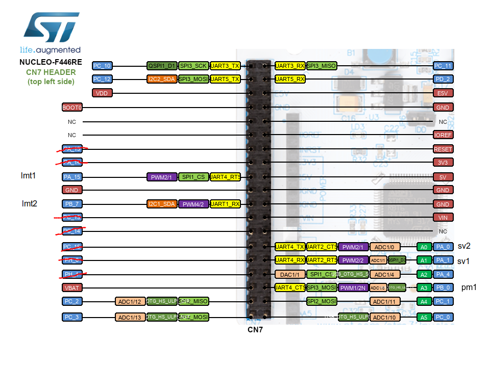
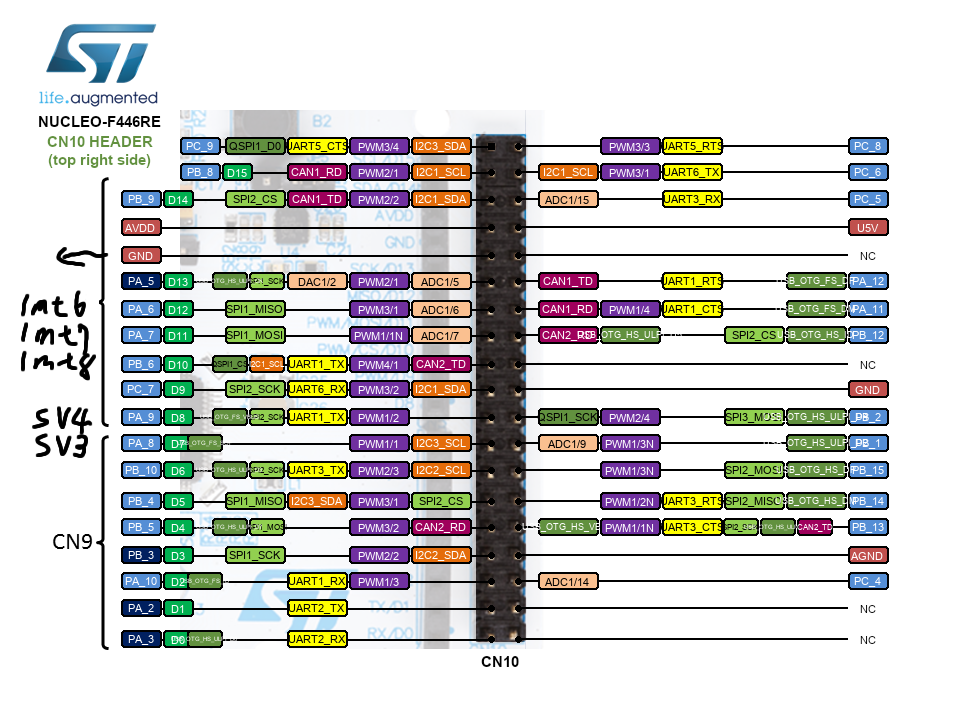

# ControllerHub_1

This software is robot controll program that works with [nucleo_agent](https://github.com/NeyagawaRobocons/nucleo_agent).
- board : NUCLEO-F446RE

## pin assignment
| pin | function |
| --- | --- |
| PA_14 | swclk |
| PA_13 | swdio |
| PB_13 | swo |
| --- | --- |
| PA_2 (CONSOLE_TX) | serial TX to PC |
| PA_3 (CONSOLE_RX) | serial RX to PC |
| PA_5 (LED1)       | board LED |
| PC_13 (BUTTON1)  | board user button |
| PA_11 | CAN1 RX |
| PA_12 | CAN1 TX |
| --- | --- |
| PC_4 | encoder 1 A |
| PC_5 | encoder 1 b |
| PC_6 | encoder 2 A |
| PC_7 | encoder 2 b |
| PC_8 | encoder 3 A |
| PC_9 | encoder 3 b |
| --- | --- |
| PA_15 | limit switch 1|
| PB_7 | limit switch 2|
| PB_0 | potentionmeter 1 |
| PA_1 | servo motor 1 |
| PA_0 | servo motor 2 |

